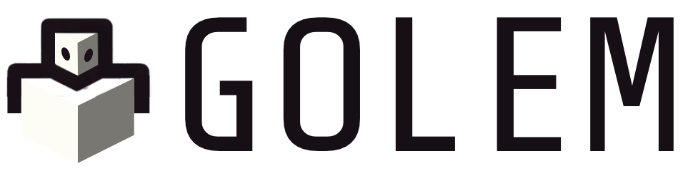

# Golem

### Phases
Plan -> Evaluate -> Coordinate -> [Recruit] -> Implement -> Reflect -> Refine

## Methods

#learn

learn about topics, summarize and refine

#ask

Ask for human intervention

#reflect

Reflect on the results produced, ensuring the result adheres to the constraints given to complete the task.

#remember

Store result in given memory context. 

[LLM Context] -> [Short Term (Summarized)] -> [Long Term (Logs)] -> [Indexed (DB)]

#summarize

### Sandbox Interface

#write

#read

## Reflections
Golems can self reflect for a number of iterations, ensuring the actions produced follow the conventions and produce the intended results.

## Conventions
Conventions are composable traits that you wish to apply to your Golems to make sure they adhere to your standards.

## Rituals
These are the workflows designed to solve a problem using your Golems

### Budgets
Set budgets for individual Golems and Rituals

